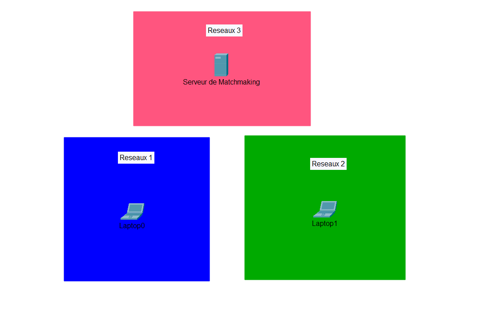

# Projet Serveur Matchmaking

### Première étapes : Création de la VM serveur 

Visualistation du reseaux 


Notre réseaux est composé d'un serveur et de 2 pc. Le serveur est utilisé pour faire communiquer les 2 pc entre eux et les 2 pc sont des pc de joueurs sur lesquel le jeux est installé et qui joue l'un contre l'autre sachant que le serveur et chaque pc peuvnent etre sur des réseaux différents.

1 serveur :
    - crée la communication entre les pc

2 pc joueur :
    - jeux installé dessus


# Installation et configuration d'une VM serveur pour le matchmaking

## 1️⃣ Prérequis

Avant de commencer, assure-toi d'avoir :

- Une VM sous **Linux (Ubuntu/Debian recommandé)**
- **Node.js** installé (v16+ recommandé)
- **Ngrok** pour exposer le serveur sur Internet

## 2️⃣ Installation de Node.js et npm

Connecte-toi à ta VM et installe Node.js :

```bash
sudo apt update && sudo apt upgrade -y
sudo apt install -y git curl ufw
curl -fsSL https://deb.nodesource.com/setup_16.x | sudo -E bash -
sudo apt install -y nodejs
```

Configurer le pare-feu :

```bash
sudo ufw allow 22  # SSH
sudo ufw allow 80  # HTTP
sudo ufw allow 443 # HTTPS
sudo ufw allow 3000  # WebSocket
sudo ufw enable
```

Vérifie l'installation :

```bash
node -v  # Affiche la version de Node.js
npm -v   # Affiche la version de npm
```

---

## 3️⃣ Installation du serveur Express + Socket.IO

### 📌 Création du projet

```bash
mkdir matchmaking-server && cd matchmaking-server
npm init -y
```

### 📌 Installation des dépendances

```bash
npm install express socket.io sqlite3 cors body-parser uuid bcrypt
```

### 📌 Création du fichier `server.js`

```javascript
const express = require('express');
const http = require('http');
const { Server } = require('socket.io');
const sqlite3 = require('sqlite3').verbose();
const cors = require('cors');
const bodyParser = require('body-parser');
const { v4: uuidv4 } = require('uuid');
const bcrypt = require('bcrypt');

const app = express();
const server = http.createServer(app);
const io = new Server(server, {
    cors: { origin: '*' }
});

app.use(cors());
app.use(bodyParser.json());

const db = new sqlite3.Database('./chess.db');
db.serialize(() => {
    db.run(`CREATE TABLE IF NOT EXISTS users (
        id TEXT PRIMARY KEY,
        username TEXT UNIQUE,
        password TEXT,
        elo INTEGER DEFAULT 1200
    )`);

    db.run(`CREATE TABLE IF NOT EXISTS games (
        id INTEGER PRIMARY KEY AUTOINCREMENT,
        player_white TEXT,
        player_black TEXT,
        winner TEXT,
        started_at DATETIME DEFAULT CURRENT_TIMESTAMP,
        ended_at DATETIME
    )`);

    db.run(`CREATE TABLE IF NOT EXISTS current_games (
        game_id TEXT PRIMARY KEY,
        player_white TEXT,
        player_black TEXT,
        board_state TEXT,
        white_time_left INTEGER,
        black_time_left INTEGER,
        last_move_at DATETIME
    )`);

    db.run(`CREATE TABLE IF NOT EXISTS moves (
        id INTEGER PRIMARY KEY AUTOINCREMENT,
        game_id TEXT,
        turn INTEGER,
        move TEXT,
        player TEXT,
        timestamp DATETIME DEFAULT CURRENT_TIMESTAMP
    )`);
});

app.post('/api/auth', async (req, res) => {
    const { username, password } = req.body;
    db.get('SELECT * FROM users WHERE username = ?', [username], async (err, row) => {
        if (err) return res.status(500).json({ error: err.message });

        if (row) {
            const valid = await bcrypt.compare(password, row.password);
            if (valid) {
                return res.status(200).json({ message: 'Login OK', id: row.id, elo: row.elo });
            } else {
                return res.status(403).json({ error: 'Mot de passe incorrect' });
            }
        } else {
            const hashed = await bcrypt.hash(password, 10);
            const id = uuidv4();
            db.run('INSERT INTO users (id, username, password) VALUES (?, ?, ?)', [id, username, hashed], (err) => {
                if (err) return res.status(500).json({ error: err.message });
                return res.status(200).json({ message: 'Compte créé', id, elo: 1200 });
            });
        }
    });
});

app.get('/api/user/:id', (req, res) => {
    const { id } = req.params;
    db.get('SELECT username, elo FROM users WHERE id = ?', [id], (err, row) => {
        if (err) return res.status(500).json({ error: err.message });
        if (!row) return res.status(404).json({ error: 'Utilisateur non trouvé' });
        res.status(200).json(row);
    });
});

let queue = [];
const activeGames = {}; // gameId -> { white: { id, socketId }, black: { id, socketId } }

io.on('connection', (socket) => {
    console.log('Connecté :', socket.id);

    socket.on('register_socket', ({ gameId, playerColor }) => {
        if (!activeGames[gameId]) {
            console.warn(`[REGISTER] gameId inconnu : ${gameId}`);
            return;
        }

        if (playerColor === 'white') {
            activeGames[gameId].white.socketId = socket.id;
        } else if (playerColor === 'black') {
            activeGames[gameId].black.socketId = socket.id;
        }

        console.log(`[REGISTER] ${playerColor} socket mis à jour pour gameId ${gameId} : ${socket.id}`);
    });

    socket.on('join_queue', ({ id, elo, guest }) => {
        const player = { socket, id, elo: guest ? 1200 : elo, guest };
        queue.push(player);
        console.log(`${id || socket.id} en file (${guest ? 'invité' : 'utilisateur'}). File: ${queue.length}`);

        const index = queue.findIndex(p => p.socket.id !== socket.id &&
            (guest || p.guest || Math.abs(p.elo - player.elo) <= 150));

        if (index !== -1) {
            const opponent = queue.splice(index, 1)[0];
            queue = queue.filter(p => p.socket.id !== socket.id);

            const colors = ['white', 'black'];
            const color1 = colors[Math.floor(Math.random() * 2)];
            const color2 = color1 === 'white' ? 'black' : 'white';

            const gameId = uuidv4();
            activeGames[gameId] = {
                white: {
                    id: color1 === 'white' ? id : opponent.id,
                    socketId: color1 === 'white' ? socket.id : opponent.socket.id
                },
                black: {
                    id: color1 === 'black' ? id : opponent.id,
                    socketId: color1 === 'black' ? socket.id : opponent.socket.id
                }
            };

            db.run(
              `INSERT OR REPLACE INTO current_games (game_id, player_white, player_black, board_state, white_time_left, black_time_left)
               VALUES (?, ?, ?, ?, ?, ?)`,
              [gameId, activeGames[gameId].white.id, activeGames[gameId].black.id, '', 600, 600]
            );

            player.socket.emit('match_found', {
                opponent: opponent.id || opponent.socket.id,
                color: color1,
                gameId,
                opponent_guest: opponent.guest
            });

            opponent.socket.emit('match_found', {
                opponent: id || socket.id,
                color: color2,
                gameId,
                opponent_guest: guest
            });
        }
    });

    socket.on('move', ({ start, end, gameId, playerId }) => {
        const moveStr = `${start[0]},${start[1]}->${end[0]},${end[1]}`;

        db.run(
          `INSERT INTO moves (game_id, move, player) VALUES (?, ?, ?)`,
          [gameId, moveStr, playerId]
        );

        const players = activeGames[gameId];
        if (!players) {
            console.warn(`[MOVE] Ignoré : gameId inconnu ${gameId}`);
            return;
        }

        let targetSocketId = null;

        if (players.white.socketId === socket.id) {
            targetSocketId = players.black.socketId;
        } else if (players.black.socketId === socket.id) {
            targetSocketId = players.white.socketId;
        } else {
            console.warn(`[MOVE] Socket ${socket.id} non reconnu dans gameId ${gameId}`);
            return;
        }

        console.log(`[EMIT] opponent_move à ${targetSocketId} depuis ${socket.id}`);
        io.to(targetSocketId).emit('opponent_move', { start, end });
    });

    socket.on('end_game', ({ gameId, winner }) => {
        const players = activeGames[gameId];
        if (!players) return;

        db.get(`SELECT player_white, player_black FROM current_games WHERE game_id = ?`, [gameId], (err, row) => {
            if (!err && row) {
                db.run(`INSERT INTO games (player_white, player_black, winner) VALUES (?, ?, ?)`, [
                    row.player_white,
                    row.player_black,
                    winner === 'draw' ? null : winner
                ]);
            }

            db.run(`DELETE FROM current_games WHERE game_id = ?`, [gameId]);
            delete activeGames[gameId];
        });
    });

    socket.on('disconnect', () => {
        queue = queue.filter(p => p.socket.id !== socket.id);
        console.log('Déconnecté :', socket.id);

        for (const [gameId, players] of Object.entries(activeGames)) {
            if (players.white.socketId === socket.id || players.black.socketId === socket.id) {
                delete activeGames[gameId];
            }
        }
    });
});

server.listen(3000, () => console.log('Serveur en écoute sur le port 3000'));
```

---

## 4️⃣ Lancement du serveur

```bash
node server.js
```

Tu devrais voir :

```
Serveur en écoute sur le port 3000
```

Si tu veux que le serveur tourne en arrière-plan :

```bash
npm install -g pm2
pm2 start server.js --name matchmaking
pm2 save
```

---

## 5️⃣ Exposer le serveur avec Ngrok

### 📌 Installation de Ngrok

```bash
snap install ngrok
```

### 📌 Connexion à Ngrok

Connecte toi à ton à ton compte Ngrok et rajoute ton token d'authentification :

```bash
ngrok config add-authtoken $AUTHTOKEN
```

(Ton authtoken est disponible sur [https://dashboard.ngrok.com/get-started/your-authtoken](https://dashboard.ngrok.com/get-started/your-authtoken))

### 📌 Exposition du serveur

```bash
ngrok http 3000
```

Ngrok fournira une URL comme :

```
Forwarding https://random-subdomain.ngrok.io -> http://localhost:3000
```

Utilise cette URL pour connecter tes clients.

---
