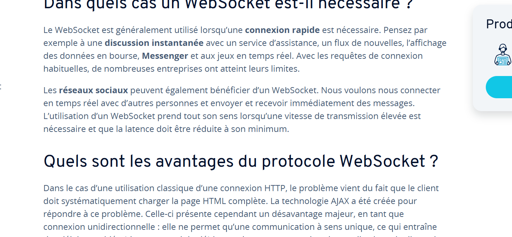

# Projet Serveur Matchmaking

### Première étapes : Création de la VM serveur 

Visualistation du reseaux 

Notre réseaux est composé d'un serveur et de 2 pc. Le serveur est utilisé pour faire communiquer les 2 pc entre eux et les 2 pc sont des pc de joueurs sur lesquel le jeux est installé et qui joue l'un contre l'autre sachant que le serveur et chaque pc peuvnent etre sur des réseaux différents.

1 serveur :
    - crée la communication entre les pc
2 pc joueur :
    - jeux installer dessus

